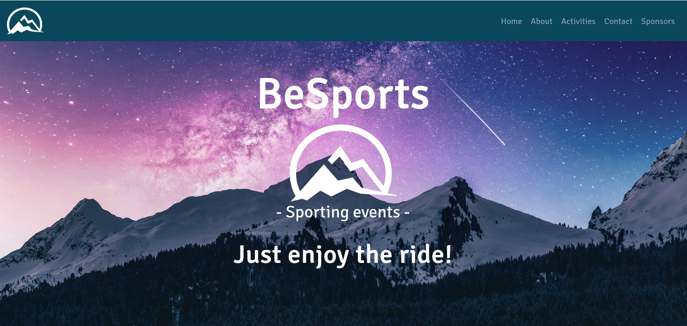
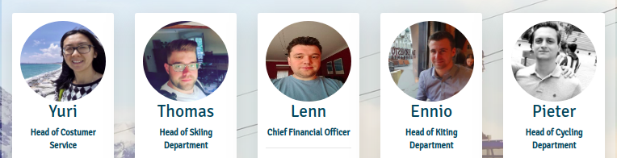

# BeSports

## Welcome to our project *BeSports*!

**BeSports** organises super fun **sports events!**
We love **kitesurfing, skiing and cycling** and want to share our passion with you! Join our events to discover the fun!
 
 
Check out our website **[BeSports.be](https://thomaswillems.github.io/BeSports/)**
 

## About us

We are a sports company based in Flanders, Belgium. We organise sport events all over the world, from cycling to skiing. You can look at our upcoming events and start dreaming about your next trip!
  
Our instructors are qualified to teach and coach all age groups!
 
Looking for an intense cycling training? Or rather have an exciting experience in the snow? Not a fan of land under your feet? We organise kite events aswell!
 
 
Call us or email us by clicking on the icons in the contact page.
Fill out the form to enroll for our activities!
 
 
## Teamwork
Our enthousiastic team is:

Design & styling of the pages:
* Yuri - homepage
* Pieter - about
* Thomas - activities
* Ennio - contact
* Lenn - sponsors

## Recources

The making of the website is a group project using Git, Bootstrap, Vanilla CSS and HTML5. We used Fontawesome, Google Fonts and Formspree as well. The scores on the Lighthouse test are good on all pages. Data are gathered through Google Analytics.  

&nbsp;&nbsp;&nbsp;&nbsp;&nbsp;&nbsp;&nbsp;&nbsp;
 
